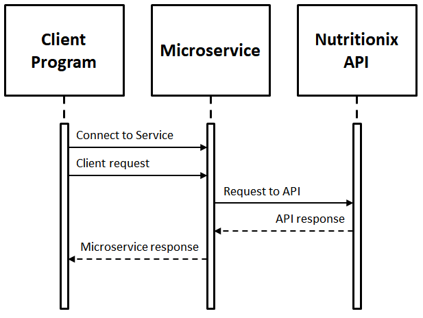

**Microservice Requests:**

Step 1: Download and run this microservice

Step 2: Connect to a websocket at "tcp://{server}:5555" (e.g. "tcp://localhost:5555")

Step 3: Send a _JSON formatted_ request with the following information

    {
      "search_term": "search_term_goes_here",
      "ingredients":
      [
        "ingredient_1",
        "ingredient_2",
        "ingredient_3"
      ]
    }

NOTE: Either "search_term" or "ingedients" can be empty, but not both

NOTE: "Search_term" and "ingredients" can include serving size modifications (e.g. "1/4 cup sugar" vs "1/2 cup sugar" vs "100g sugar")

NOTE: "Search_term" can include mulitple items (e.g. "1 egg, 1 cup flour, 1/2 cup skim milk, 1 tsp baking soda")

**Response Format (on success):**

    {
      "success": true
      "data":
      [
        {
          "food_name": "ingredient_name",
          "serving_size": #,
          "serving_unit": "unit_of_issue",
          "calories": #,
          "total_fat": #,
          "saturated_fat": #,
          "cholesterol": #,
          "sodium": #,
          "carbohydrates": #,
          "fiber": #,
          "sugar": #,
          "protein": #
        },
        {
          "food_name": "ingredient_name_2",
          ...
        },
        ...
      ]
    }

NOTE: "#" represents JSON numbers, which may be integers or floating point

**Response Format (on failure):**

    {
      "success": false
      "data":
      [
        {
          "message": "error_message_here"
        }
      ]
    }

NOTE: If no search terms or ingredients are passed, the following error message will be returned "Request must contain search term or ingredient list"

NOTE: If the API is not able to find any of your ingredients, the following error message will be returned "We couldn't match any of your foods"

NOTE: If only some ingredients are found, only the identified ingredients will be returned

**UML sequence diagram:**

